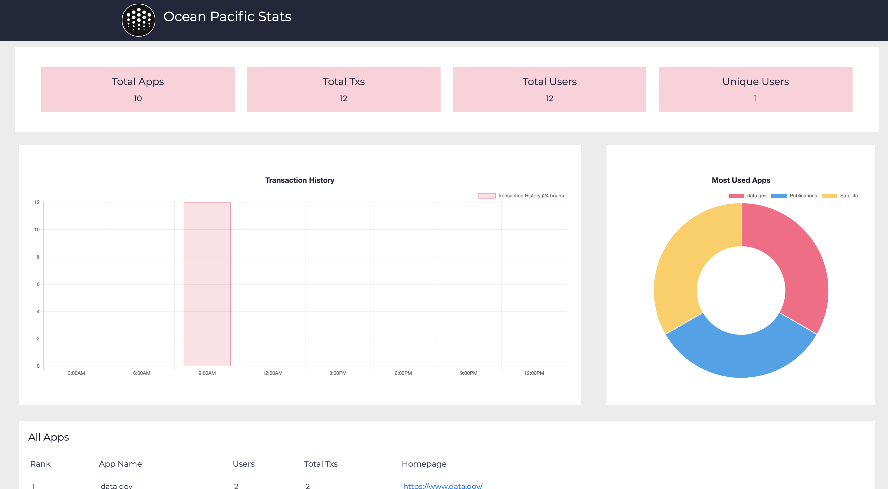
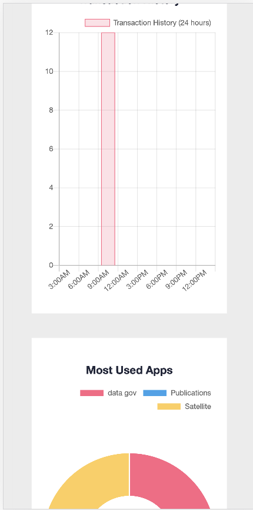

# ocean-stats
Ocean Protocol stats for Pacific network Apps. This is a responsive web app that tracks and displays off-chain stats for Apps built on Ocean Protocol.

* Responsive design for smaller screens (like mobile browsers)

#### Tracked using metadata

Way this works is to add custom fields of app id and statsboard id to metadata of for Ocean Protocol's DDO objects. I have integrated with google sheets as required in bounty. I am using google's REST API to get details from google sheet for App data and Aquarius REST API (OceanDB) to get details of tx counts, total users, users per app and txs per app.

In order to use this dashboard, you will have to generate a "statsboardId" (any random id) and feed it into the publish flow along with individual registered app Ids. 

## Installation and Usage

1. Create a `.env` file using `.env.example` fill in details

1. install deps
`npm i`

1. start app
`npm start`
